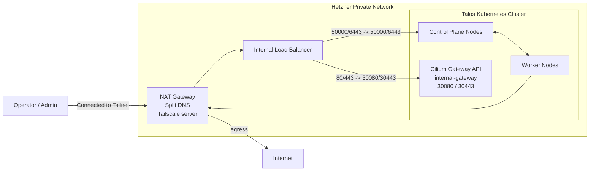

# Demo Cluster IaC

## Architecture

```mermaid
flowchart LR
  admin["Operator / Admin"]
  internet["Internet"]

  subgraph hcloud["Hetzner Private Network"]
    lb["Internal Load Balancer"]
    nat["NAT Gateway</br>Split DNS</br>Tailscale server"]

    subgraph cluster["Talos Kubernetes Cluster"]
      cp["Control Plane Nodes"]
      workers["Worker Nodes"]
      gateway["Cilium Gateway API<br/>internal-gateway<br/>30080 / 30443"]
    end
  end

  admin -->|"Connected to Tailnet"| nat
  nat --> lb

  lb -->|"50000/6443 -> 50000/6443"| cp
  cp <--> workers
  lb -->|"80/443 -> 30080/30443"| gateway

  workers --> nat
  nat -->|"egress"| internet
```
